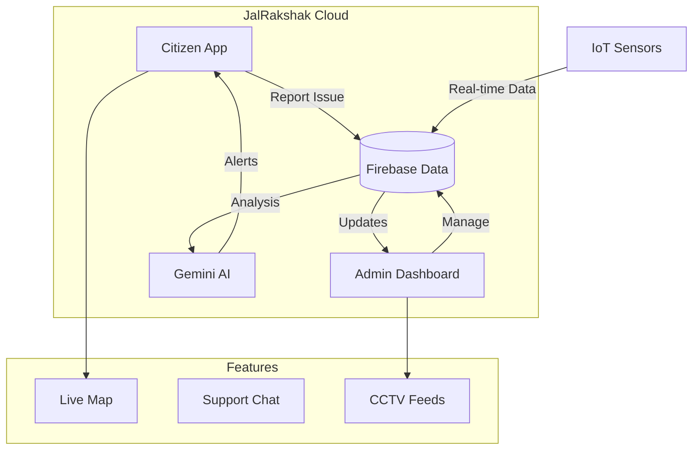

# 💧 JalRakshak - Smart Water Monitoring System

**JalRakshak** is a Next-Generation Smart Water Health & Flood Monitoring System designed for real-time tracking of water quality, flood risks, and citizen complaints. It seamlessly connects citizens with administrators through a responsive web and mobile application.


## 🚀 Key Features

### 🌍 For Citizens
- **Real-time Dashboard**: View live water levels of Panchganga River and city water quality (pH, Turbidity).
- **Interactive Map**: Check safe/unsafe zones on a live map.
- **Complaint Reporting**: Report issues (Pipe Bursts, Logging) with location auto-detection.
- **AI Assistant**: "JalRakshak Bot" powered by **Google Gemini** for safety tips and queries.
- **Chat System**: Direct communication with support.

### 👮 For Administrators
- **Command Center**: Complete overview of all city sensors and active alerts.
- **Live Surveillance**: **[NEW]** Monitor CCTV feeds from critical zones (Panchganga Ghat, Rankala, etc.).
- **Complaint Management**: Update statuses and send detailed resolution notes to citizens.
- **Data Export**: Download complete complaint logs as CSV for offline analysis.
- **Broadcast Alerts**: Send emergency flood warnings to all users.

### 📱 Android Mobile App
- Native Android experience powered by **Capacitor**.
- Fully functional offline map caching.
- Optimized for mobile interactions.

---

## 🛠️ Technology Stack

| Component | Technology |
|-----------|------------|
| **Frontend** | [Next.js 16](https://nextjs.org/) (React 19, TypeScript) |
| **Styling** | Custom CSS Modules, Lucide Icons |
| **State/Auth** | [Firebase](https://firebase.google.com/) (Auth, Firestore, Hosting) |
| **Maps** | [Leaflet](https://leafletjs.com/) + OpenStreetMap |
| **Charts** | [Recharts](https://recharts.org/) |
| **AI** | [Google Gemini API](https://ai.google.dev/) |
| **Mobile** | [Capacitor](https://capacitorjs.com/) (Android) |

---

## 🏗️ Architecture Flow



---

## 📸 Screenshots

| Dashboard | Live Map |
|-----------|----------|
|  |  |

| Camera Surveillance | Complaint Management |
|---------------------|----------------------|
|  |  |

---

## ⚡ Getting Started

### 1. Prerequisites
- Node.js 18+
- Firebase Account
- Google Gemini API Key

### 2. Installation
```bash
# Clone the repository
git clone https://github.com/Start-Sparta/jalshakshak_app.git
cd jalrakshak_app

# Install dependencies
npm install

# Run Development Server
npm run dev
```

### 3. Mobile App (Android)
```bash
# Build web assets
npm run build

# Sync with Android project
npx cap sync

# Open in Android Studio
npx cap open android
```

---

## 🔐 Credentials (Demo)

| Role | Email | Password |
|------|-------|----------|
| **Admin** | `admin@jalrakshak.com` | `admin123` |
| **Citizen** | `user@example.com` | `user123` |

2026 © JalRakshak Team | Built for safe and smart cities.
