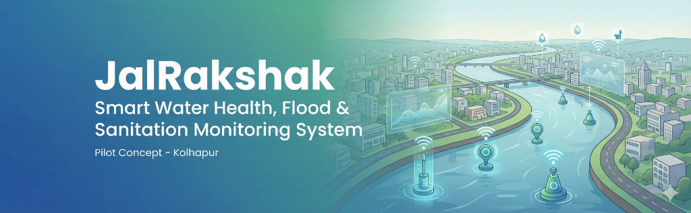
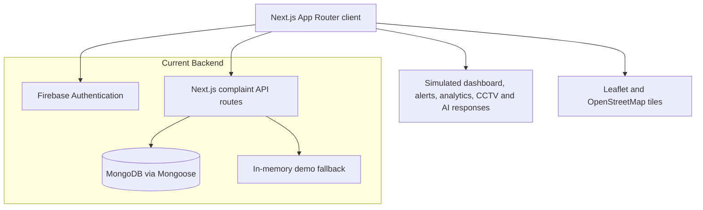
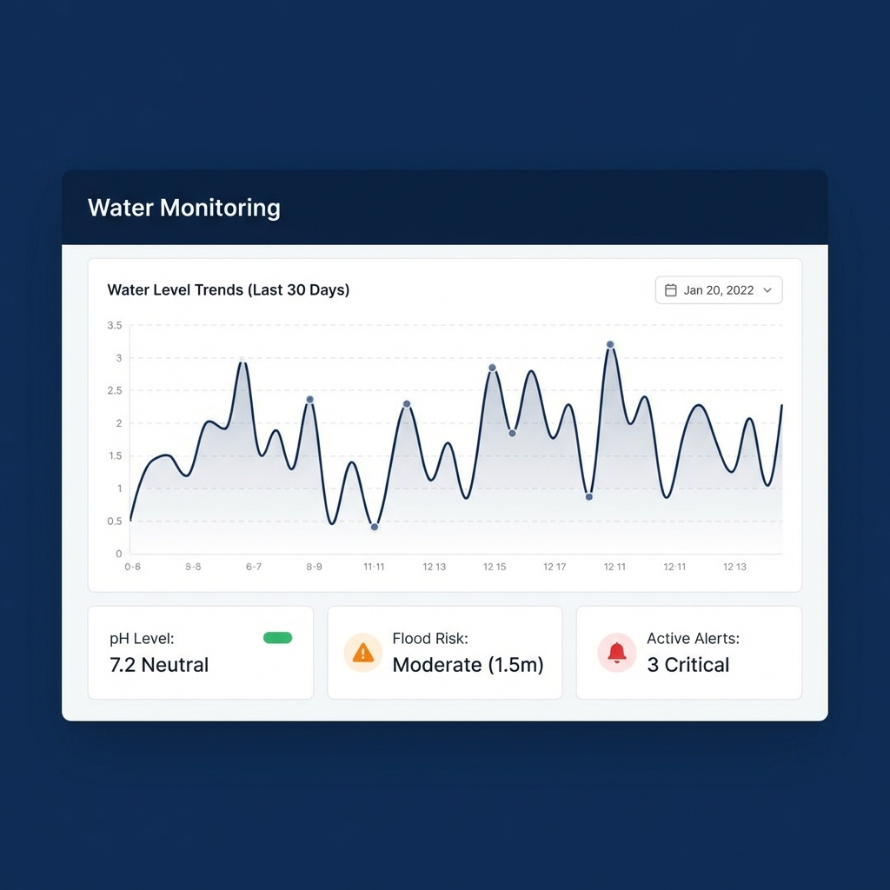
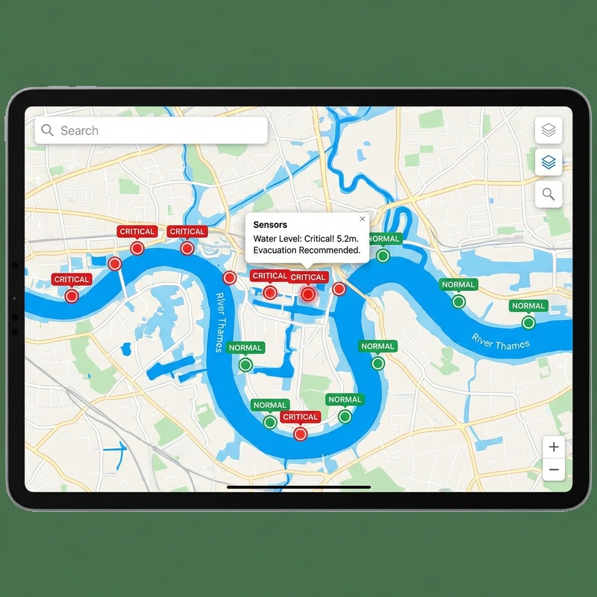
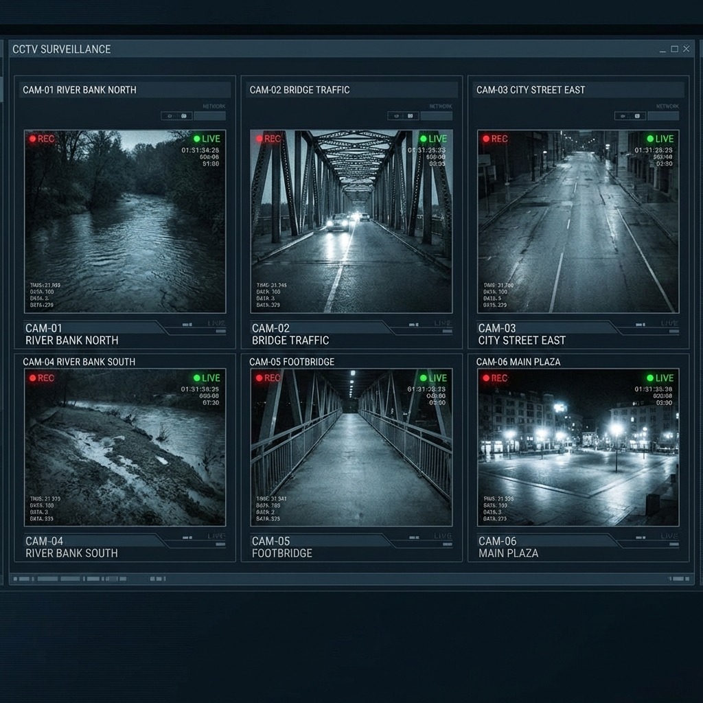
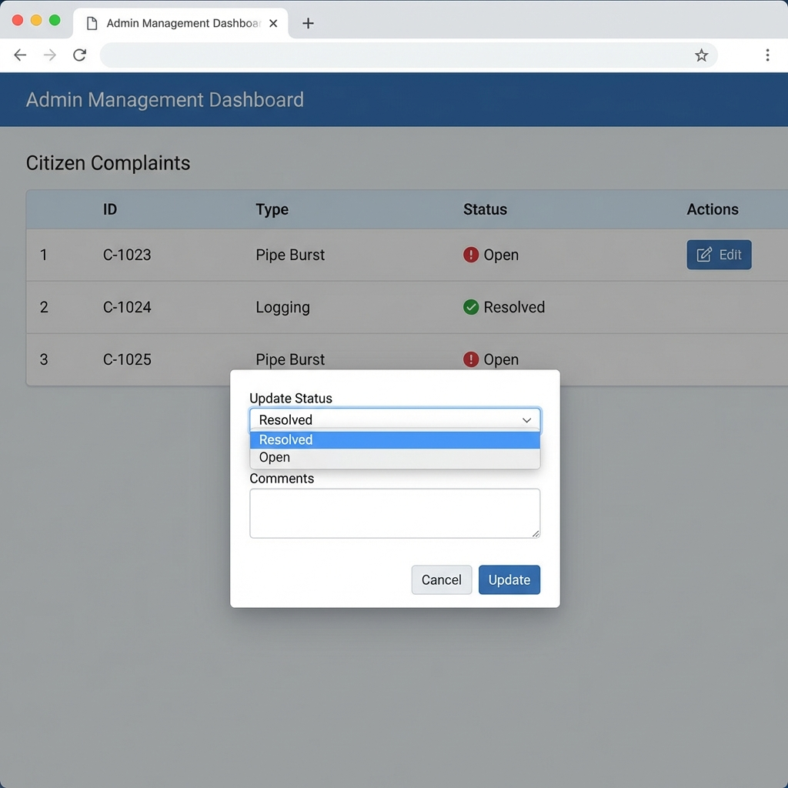

# JalRakshak

[](LICENSE)
[](https://github.com/Ravirajm07/jal-rakshak-app/actions/workflows/ci.yml)

JalRakshak is a prototype civic-tech app for water-quality views, flood-risk indicators, sanitation reports, citizen alerts, and administrative complaint workflows.



## Project Status

JalRakshak is preparing an initial public open-source `v0.1.0` release. It is useful as an educational prototype and development base, but it is not production-ready.

Live demo: [https://jal-rakshak-app.vercel.app/](https://jal-rakshak-app.vercel.app/)  
Checked on 2026-07-13: the root route redirects to `/login` and returns HTTP 200.

## Safety Disclaimer

JalRakshak is currently a prototype/educational civic-tech project. Sensor, flood, CCTV and water-quality information may be simulated and must not be used as the sole source for emergency, medical or public-safety decisions.

## Verified Features

- Firebase Authentication sign-up and sign-in from the Next.js client.
- Citizen and admin dashboard views selected from client-side role state.
- Demo mode role switching for local walkthroughs.
- MongoDB/Mongoose-backed complaint API routes with in-memory demo fallback when MongoDB is unavailable.
- Citizen report form with issue type, location text/map selection, description, and optional local file picker.
- Complaint status updates, admin response notes, and CSV export from the UI.
- Simulated water-level, water-quality, flood-risk, alert, analytics, and decision-support views.
- Leaflet/OpenStreetMap map with static sample hazard markers.
- Simulated camera grid with optional user-entered IP camera URL display.
- Simulation-only assistant responses for water/flood/reporting questions.
- Capacitor Android project scaffold.

## Architecture Overview


```mermaid
flowchart TD
    Browser[Next.js App Router client] --> FirebaseAuth[Firebase Authentication]
    Browser --> ComplaintAPI[Next.js complaint API routes]
    ComplaintAPI --> MongoDB[(MongoDB via Mongoose)]
    ComplaintAPI --> DemoStore[In-memory demo fallback]
    Browser --> SimulatedData[Simulated dashboard, alerts, analytics, CCTV and AI responses]
    Browser --> Leaflet[Leaflet and OpenStreetMap tiles]

    subgraph Current Backend
        FirebaseAuth
        ComplaintAPI
        MongoDB
        DemoStore
    end
```

The current app uses Firebase Authentication for identity and MongoDB for persistent complaint storage. Firestore is not used by runtime application code in `v0.1.0`; `firestore.rules` denies all access by default as a protective placeholder.

## Technology Stack

| Area | Technology |
| --- | --- |
| Web app | Next.js 16, React 19, TypeScript |
| Styling | CSS Modules, Tailwind utility classes, Lucide React icons |
| Auth | Firebase Authentication client SDK |
| Complaint persistence | MongoDB and Mongoose |
| Prototype fallback | In-memory demo store and browser localStorage |
| Maps | Leaflet, React Leaflet, OpenStreetMap tiles |
| Charts | Recharts |
| Mobile scaffold | Capacitor Android |
| Tests | Vitest |
| CI | GitHub Actions |

## Repository Structure

```text
src/app/                    Next.js App Router pages and API routes
src/app/api/complaints/     MongoDB-backed complaint route handlers
src/components/             UI, layout, dashboard, map and admin components
src/config/                 Navigation configuration
src/lib/                    Firebase client setup, validation, demo store and app context
src/models/                 Mongoose models
android/                    Capacitor Android project scaffold
public/assets/              Screenshots and app images
docs/                       Release, audit and remediation documentation
.github/                    CI, issue templates and pull request template
```

## Prerequisites

- Node.js 22.x recommended for parity with CI.
- npm 10.x.
- A Firebase project for Authentication, or the Firebase Auth Emulator.
- A MongoDB database for persistent complaint storage.
- Android Studio only if working on the Capacitor Android scaffold.

## Installation

```bash
git clone https://github.com/Ravirajm07/jal-rakshak-app.git
cd jal-rakshak-app
npm ci
npm run dev
```

Open [http://localhost:3000](http://localhost:3000).

## Environment Variables

Copy the example file and replace placeholders with your own development values:

```bash
cp .env.example .env.local
```

The application reads these variables:

| Variable | Required | Purpose |
| --- | --- | --- |
| `NEXT_PUBLIC_FIREBASE_API_KEY` | Yes for Firebase Auth | Firebase web app API key |
| `NEXT_PUBLIC_FIREBASE_AUTH_DOMAIN` | Yes for Firebase Auth | Firebase Auth domain |
| `NEXT_PUBLIC_FIREBASE_PROJECT_ID` | Yes for Firebase Auth | Firebase project ID |
| `NEXT_PUBLIC_FIREBASE_STORAGE_BUCKET` | Yes for Firebase app config | Firebase storage bucket value |
| `NEXT_PUBLIC_FIREBASE_MESSAGING_SENDER_ID` | Yes for Firebase app config | Firebase messaging sender ID |
| `NEXT_PUBLIC_FIREBASE_APP_ID` | Yes for Firebase Auth | Firebase web app ID |
| `NEXT_PUBLIC_FIREBASE_MEASUREMENT_ID` | Optional | Firebase measurement ID |
| `NEXT_PUBLIC_USE_FIREBASE_EMULATOR` | Optional | Set to `true` to connect Auth to `127.0.0.1:9099` |
| `MONGODB_URI` | Required for persistent complaints | MongoDB connection string used by API routes |

Do not commit real `.env*` files, service-account JSON, database URLs, private keys, Gemini keys, or demo passwords.

## Firebase and Emulator Setup

For local Firebase Authentication testing without real users:

```bash
npm install -g firebase-tools
firebase emulators:start --only auth,firestore --project demo-jalrakshak
```

Then set:

```env
NEXT_PUBLIC_USE_FIREBASE_EMULATOR=true
```

Firestore is currently not used by the application. The included `firestore.rules` file denies all Firestore reads and writes until a real Firestore data model and rule tests are added.

## Development Server

```bash
npm run dev
```

The root route redirects to `/login`. You can create a local Firebase Auth user from the sign-up form when Firebase config or the Auth Emulator is available.

Demo access is disabled by default. Maintainers may provision temporary demo users outside the repository. Production credentials must never be committed.

## Testing

```bash
npm test
```

Current tests cover complaint payload validation for create and update flows.

## Linting and Type Checking

```bash
npm run lint
npm run typecheck
```

## Production Build

```bash
npm run build
npm start
```

The app can build without a live MongoDB connection. Complaint API routes use `MONGODB_URI` at runtime and fall back to demo data if the database connection fails.

## Android and Capacitor

The repository contains a Capacitor Android scaffold under `android/`, but the current Next.js app depends on route handlers for complaint APIs and does not emit a static `out/` directory during the normal web build.

Use the Android project as experimental scaffolding until a maintainer chooses one of these strategies:

- add a dedicated static export/mobile build that talks to a hosted API, or
- package a WebView that points to a deployed web app, or
- replace route-handler dependencies for offline/mobile use.

Common Capacitor commands after a mobile build strategy is implemented:

```bash
npx cap sync android
npx cap open android
```

## Vercel Deployment

1. Import `https://github.com/Ravirajm07/jal-rakshak-app` into Vercel.
2. Add the Firebase web config variables from `.env.example`.
3. Add `MONGODB_URI` for persistent complaint storage.
4. Deploy.

Do not add Gemini API keys to public client variables. Any future live AI integration should run through server-side route handlers with authentication, input validation, abuse prevention, and safe logging.

## Security

Please read [SECURITY.md](SECURITY.md) before reporting vulnerabilities. Do not open public issues containing secrets, tokens, private user data, exploit payloads, or production credentials.

Known security limitations are tracked in [docs/OPEN_SOURCE_READINESS_AUDIT.md](docs/OPEN_SOURCE_READINESS_AUDIT.md).

## Contributing

Please read [CONTRIBUTING.md](CONTRIBUTING.md). Beginner-friendly issue drafts are available in [docs/BEGINNER_FRIENDLY_ISSUES.md](docs/BEGINNER_FRIENDLY_ISSUES.md).

## Roadmap

- Add server-side Firebase ID-token verification for API routes.
- Implement reliable admin authorization using custom claims or another server-verified role source.
- Add MongoDB integration tests and route-handler tests.
- Decide and implement the Android/Capacitor release strategy.
- Replace simulated sensor, CCTV, alert, and AI data with explicit integrations only when verified sources exist.
- Add Firestore data modeling and emulator rule tests if Firestore becomes part of the runtime architecture.
- Add rate limiting and abuse prevention to write routes.

## Screenshots

| Dashboard | Map |
| --- | --- |
|  |  |

| Camera View | Admin View |
| --- | --- |
|  |  |

## License

Licensed under the [Apache License 2.0](LICENSE).

Copyright 2026 JalRakshak contributors.

## Maintainers and Contributors

Git history currently shows contributions from `Sanskar` and `RAVIRAJ MORE`, including commits associated with the `Ravirajm07` GitHub noreply address. Copyright is attributed to JalRakshak contributors rather than a single individual.
